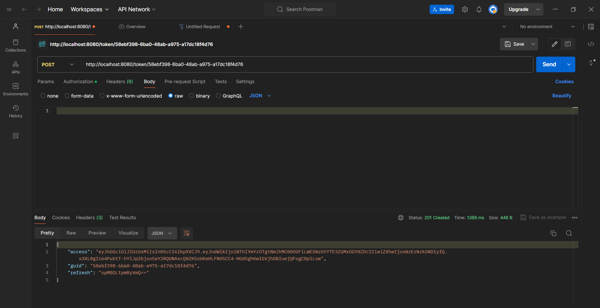
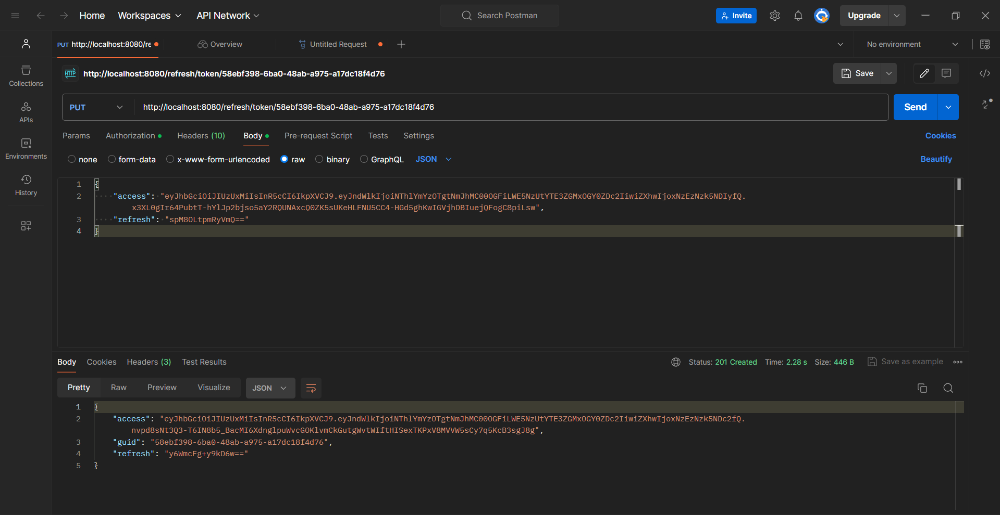

# Test task BackDev

### Тестовое задание на позицию Junior Backend Developer

**Используемые технологии:**

- Go
- JWT
- MongoDB

**Задание:**

Написать часть сервиса аутентификации.

Два REST маршрута:

- Первый маршрут выдает пару Access, Refresh токенов для пользователя сидентификатором (GUID) указанным в параметре запроса
- Второй маршрут выполняет Refresh операцию на пару Access, Refreshтокенов

**Требования:**

Access токен тип JWT, алгоритм SHA512, хранить в базе строго запрещено.

Refresh токен тип произвольный, формат передачи base64, хранится в базеисключительно в виде bcrypt хеша, должен быть защищен от изменения настороне клиента и попыток повторного использования.

Access, Refresh токены обоюдно связаны, Refresh операцию для Access токена можно выполнить только тем Refresh токеном который был выдан вместе с ним.

**Результат:**

Результат выполнения задания нужно предоставить в виде исходного кода на Github.

Сервер генерирует пару токенов access и refresh и отсылает на клиент. Клиент мониторит состояние access токена по его времени жизни, как только он истек клиент отправляет запрос на обновление ключей. Сервер принимает Refresh токен, проверяет на валидность. Если не находит такого Refresh, то возваращает ошибку, если находит, то обновляет токены и отсылает обратно на клиент.

Чтобы защититься от хакеров refresh токен шифруется и валидируется. Даже если на клиенте данный токен изменят, то он просто не пройдет проверку.

### Эндпоинты

Токены:

- POST /token/guid - создание access и refresh токена
- PUT refresh/token/guid - обновления access и refresh токенов refresh токеном,который был выдан вместе с access токеном 

### Примеры ответов API:

Использовал Postman.

POST   /token/:guid

PUT  /refresh/token/:guid
